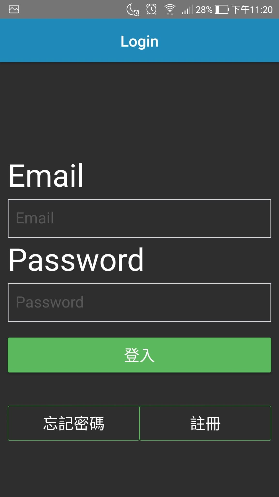
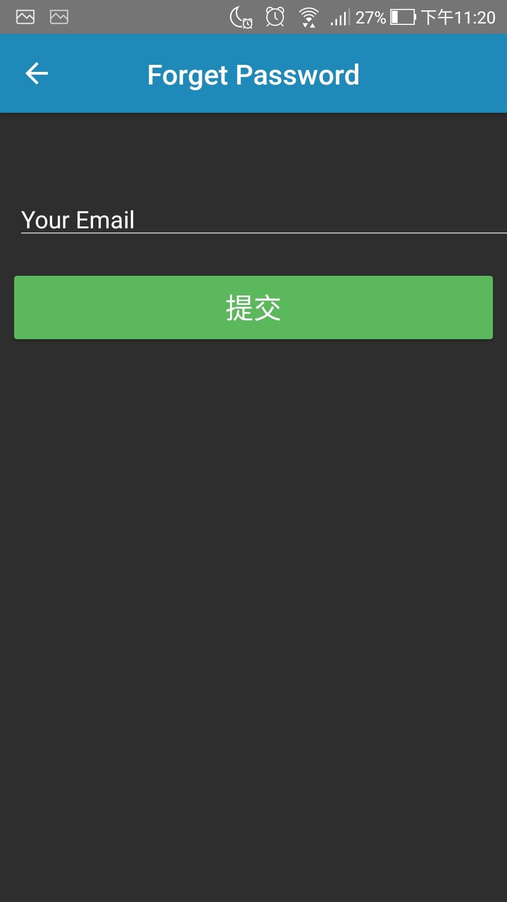
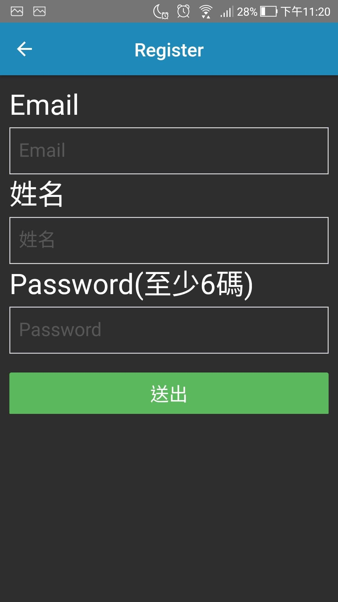
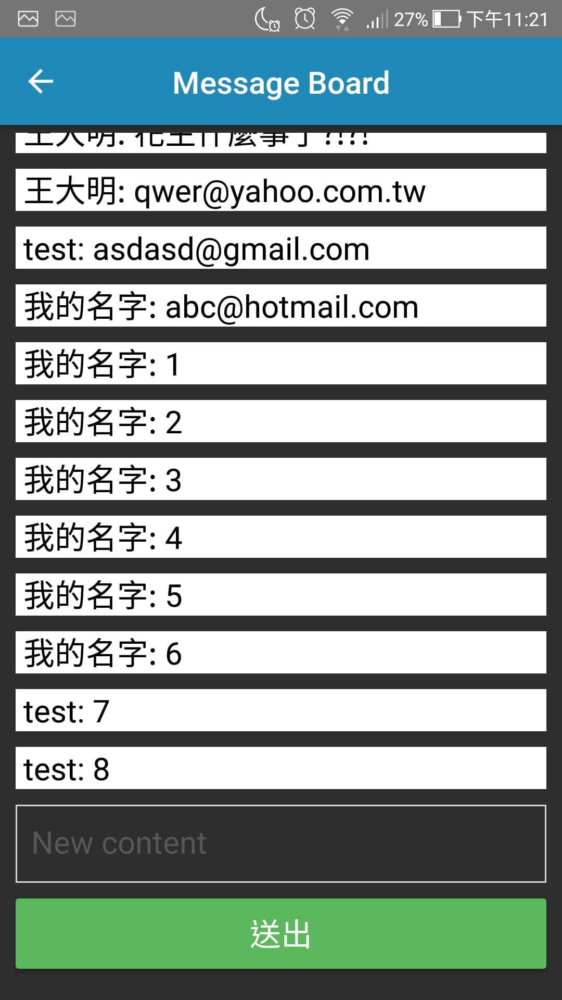

# Message-board
Simple message board on react-native android, using firebase.

## Outline

## Getting started
<b>Remember to set your own `firebaseConfig.js` under the "Message-board-master" folder first.</b> 
1. Install the necessary packages.
`npm install`
2. Run on android.
`react-native run-android`
